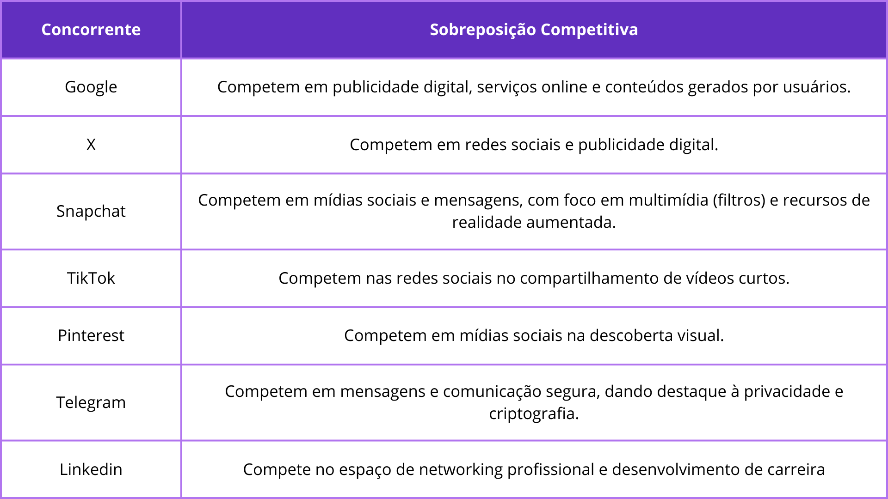
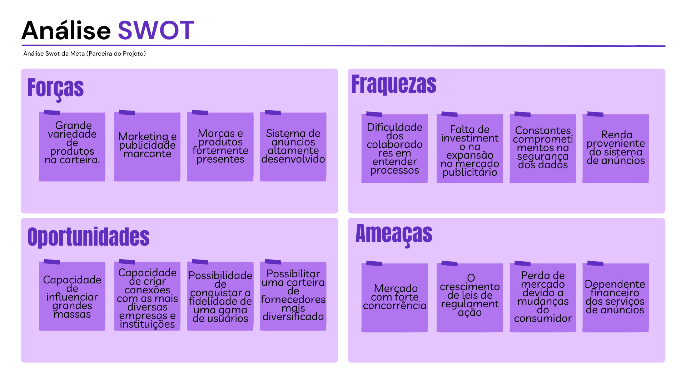
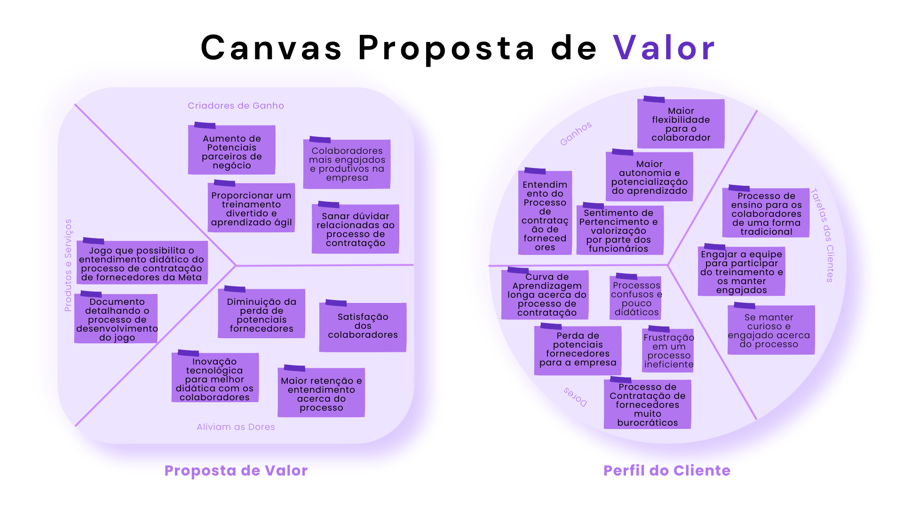
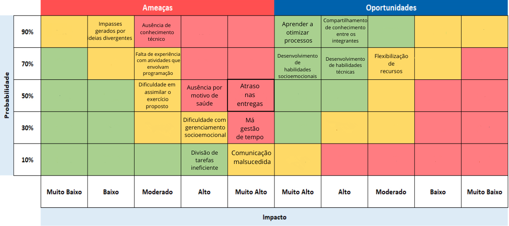

# GDD - Game Design Document - Módulo 1 - Inteli

**_Os trechos em itálico servem apenas como guia para o preenchimento da seção. Por esse motivo, não devem fazer parte da documentação final_**

## Grupo 4

#### Nomes dos integrantes do grupo
- <a>Ana Eloisa da Silva Façanha</a>
- <a>Daniel Augusto de Araújo Gonçalves</a>
- <a>Gabriel Bacci Toledo</a> 
- <a>Giovanna Fátima de Britto Vieira</a> 
- <a>Gustavo Gonçalves da Costa</a>
- <a>Larissa dos Santos Temoteo</a> 

## Sumário

[1. Introdução](#c1)

[2. Visão Geral do Jogo](#c2)

[3. Game Design](#c3)

[4. Desenvolvimento do jogo](#c4)

[5. Casos de Teste](#c5)

[6. Conclusões e trabalhos futuros](#c6)

[7. Referências](#c7)

[Anexos](#c8)

 

# 1. Introdução

## 1.1. Escopo do Projeto

### 1.1.1. Contexto da indústria

A Meta é uma empresa que tem como missão dar às pessoas o poder de criar comunidades e aproximar o mundo, dessa forma, eles desenvolvem produtos voltados para o mercado digital, resolvem problemas e trabalham juntos para conectar pessoas do mundo todo. Além disso, essa empresa possui um caráter social, logo possui ações voltadas para a diversidade, inclusão de todos e preocupação com o bem-estar dos seus funcionários.

Tendo como princípios dar voz às pessoas, criar conexão e comunidade, servir a todos, manter as pessoas seguras, proteger a privacidade e promover oportunidade econômica, a Meta atingiu 3 bilhões de usuários em todo o mundo e se tornou uma das cinco grandes empresas de tecnologia, em conjunto com a Microsoft, Amazon, Apple e Google.

Em 2004 foi lançado o Facebook, após isso, a cartela de produtos da Meta aumentou e incluiu aplicativos como o Messenger, o Instagram e o WhatsApp. Atualmente, a Meta está expandindo os negócios e indo em direção a experiências imersivas com realidade aumentada, virtual e mista. Em decorrência da vasta gama de produtos e serviços a Meta acumulou uma série de concorrentes (tabela abaixo).

Figura 1: Tabela de concorrentes da Meta. Fonte: Autor Próprio (2024)

Entretanto, apesar da vasta quantidade de concorrentes, em fevereiro de 2024 as ações da Meta dispararam e a empresa teve o maior ganho em valor de mercado em um único dia. As ações da Meta subiram 20,3% e esse ganho acrescentou US$ 206 bilhões em valor de mercado, o que fez com que a empresa se destacasse no cenário mundial e se consagrasse como a 34º posição entre as maiores empresas do globo

### 1.1.2. Análise SWOT 

A análise SWOT da Meta oferece uma visão abrangente das forças, fraquezas, oportunidades e ameaças enfrentadas pela empresa. A Meta, anteriormente conhecida como Facebook, é uma gigante global que moldou a forma como interagimos e nos conectamos digitalmente. Com uma ampla gama de produtos em sua carteira e um marketing marcante, a empresa conquistou uma presença forte e influente em todo o mundo.

Figura 2: Análise SWOT da empresa Meta. Fonte: Autor Próprio (2024)

**Forças:**
- Grande variedade de produtos na carteira; 
- Marketing e publicidade marcantes, além dos produtos com identidade visual facilmente reconhecível por grande parte das pessoas; 
- Marcas e produtos fortemente presentes e influentes no mundo todo; 
- Sistema de anúncios altamente desenvolvido, tornando-se a principal fonte de lucro da empresa. 

**Fraquezas:**
- Dificuldade dos colaboradores em entender o processo de contratação de fornecedores; 
- Falta de investimento na expansão no mercado publicitário em razão da restrição dos anúncios da meta à produtos da empresa (propaganda exclusivamente interna);  
- Constantes comprometimentos na segurança dos dados, gerando desconfiança e falta de credibilidade com os usuários, levando a perca parcial e diminuindo o ganho de usuários;  
- Apesar da diversidade de produtos na carteira, grande parte da renda da Meta provém do sistema de anúncios.  

**Oportunidades:**
- Capacidade de influenciar grandes massas, uma vez que os seus produtos são utilizados por bilhões de pessoas em todo o mundo; 
- Enorme capacidade de criar conexões com as mais diversas empresas e instituições, possibilitando o desenvolvimento de produtos com tecnologia de ponta; 
- Possibilidade de conquistar a fidelidade de uma gama de usuários para os seus produtos através de investimentos em tecnologia, segurança e privacidade; 
- Através do projeto, possibilitar uma carteira de fornecedores mais diversificada e alinhada com os propósitos da Meta. 

**Ameaças:**
- Os produtos da Meta estão inseridos em um mercado com forte concorrência;  
- O crescimento de leis de regulamentação, restringindo principalmente a captura de dados do usuário, prejudicando o funcionamento dos algoritmos de recomendação e anúncios;  
- Perda de mercado devido a mudanças na preferência do consumidor e a possível perca de mercado para outros concorrentes;  
- Apesar da grande variedade da carteira de produtos da Meta, a maioria da sua receita vem unicamente dos serviços de anúncios em suas redes sociais, tornando-os dependentes financeiramente desse único produto. 

### 1.1.3. Descrição da Solução Desenvolvida

A Meta possui um processo para a contratação de fornecedores que perpassa diversas etapas, porém vários colaboradores desconhecem ou possuem dúvidas de partes desse processo. Então, objetivando solucionar esse problema foi idealizado a criação de uma ferramenta gamificada (jogo) com o intuito de capacitar os colaboradores acerca do processo supracitado.

Dessa forma os colaboradores da Meta terão acesso ao jogo para aprender de forma interativa, recebendo feedbacks e recompensas por meio da concusão de diversos desafios ao longo do jogo. 

Sendo assim, é esperado o aumento do engajamento dos usuários devido à abordagem inovadora, promoção de uma assimilação fácil e assertiva do processo, redução dos erros cometidos ao longo do processo e o aumento na eficiência do treinamento, de forma a contribuir para o desenvolvimento dos colaborados e a eficácia do processo de contratação de fornecedores da Meta.

### 1.1.4. Proposta de Valor (sprints 1 e 4)

Com o intuito de agregar valor na nossa solução e identificar quais as necessidades dos clientes desenvolvemos um Canvas Proposta de Valor, confome consta abaixo.

Figura 3. Canvas Proposta de Valor. Fonte: Autor Próprio (2024)

**Dores**
1. **Curva de Aprendizagem longa acerca do processo de contratação:** Os colaboradores podem enfrentar dificuldades para entender e assimilar o processo de contratação de fornecedores devido à sua complexidade e falta de recursos de treinamento adequados.

2. **Processos confusos e pouco didáticos:** A falta de clareza e eficácia nos materiais de treinamento pode levar à confusão e frustração entre os colaboradores.

3. **Frustração em um processo ineficiente:** A ineficiência no processo de contratação pode causar frustração e insatisfação entre os colaboradores, afetando negativamente o desempenho e a moral da equipe.

4. **Perda de potenciais fornecedores para a empresa:** Erros ou falta de compreensão do processo de contratação podem resultar na perda de fornecedores em potencial, prejudicando as relações comerciais e o crescimento da empresa.

5. **Processo de Contratação de fornecedores muito burocráticos:** A burocracia excessiva no processo de contratação pode desencorajar potenciais fornecedores e dificultar a eficiência operacional da empresa.

**Tarefas do Cliente**
1. **Processo de ensino para os colaboradores de uma forma tradicional:** Antes da implementação do jogo, os colaboradores eram treinados de maneira mais convencional, o que pode ser menos eficaz e envolvente.

2. **Engajar a equipe para participar do treinamento e os manter engajados:** Uma das tarefas dos gestores é garantir que os colaboradores participem ativamente do treinamento e permaneçam engajados ao longo do processo.

3. **Se manter curioso e engajado acerca do processo:** Os colaboradores também têm a responsabilidade de se manterem curiosos e interessados no processo de aprendizado, buscando constantemente melhorar suas habilidades e conhecimentos.

**Ganhos**
1. **Maior flexibilidade para o colaborador:** O treinamento gamificado oferece aos colaboradores a flexibilidade de aprender no próprio ritmo e no momento que for mais conveniente para eles.

2. **Maior autonomia e potencialização do aprendizado:** A abordagem do jogo permite que os colaboradores assumam o controle do seu próprio aprendizado, explorando e experimentando o conteúdo de forma independente.

3. **Sentimento de Pertencimento e valorização por parte dos funcionários:** Ao investir no desenvolvimento profissional dos colaboradores de forma inovadora, a empresa demonstra seu compromisso com o crescimento e o bem-estar da equipe, promovendo um ambiente de trabalho positivo e inclusivo.

4. **Entendimento do Processo de contratação de fornecedores:** O treinamento eficaz proporcionado pelo jogo ajuda os colaboradores a compreender e dominar o processo de contratação de fornecedores, permitindo que eles desempenhem suas funções com mais confiança e eficiência. 

**Criadores de Ganho**
1. **Aumento de Potenciais parceiros de negócio:** Implementar o jogo de treinamento pode atrair mais fornecedores interessados em trabalhar com a Meta, devido à reputação da empresa como inovadora e comprometida com o desenvolvimento de seus colaboradores.

2. **Colaboradores mais engajados e produtivos na empresa:** Um treinamento divertido e interativo pode aumentar o engajamento dos colaboradores, o que geralmente leva a um aumento da produtividade e satisfação no trabalho.

3. **Proporcionar um treinamento divertido e aprendizado ágil:** Ao transformar o processo de aprendizado em um jogo, os colaboradores podem absorver o conhecimento de forma mais rápida e eficaz, tornando o treinamento mais eficiente e agradável.

4. **Sanar dúvidas relacionadas ao processo de contratação:** O jogo oferece uma oportunidade para os colaboradores esclarecerem suas dúvidas de forma prática e interativa, facilitando a compreensão do processo de contratação.

**Aliviam as Dores**
1. **Diminuição da perda de potenciais fornecedores:** Ao fornecer um treinamento mais eficaz e envolvente, a empresa pode reduzir a perda de fornecedores devido a erros ou falta de compreensão do processo.

2. **Satisfação dos colaboradores:** Um treinamento mais atraente e eficaz pode aumentar a satisfação dos colaboradores, ajudando a reter talentos e reduzir a rotatividade.

3. **Maior retenção e entendimento acerca do processo:** A abordagem do jogo pode ajudar os colaboradores a reter e entender melhor o processo de contratação, reduzindo a confusão e os erros.

4. **Inovação tecnológica para melhor didática com os colaboradores:** Utilizar uma abordagem tecnológica e inovadora no treinamento pode tornar o processo mais acessível e eficaz para os colaboradores.

**Produtos e Serviços**
1. **Documento detalhando o processo de desenvolvimento do jogo:** Este documento fornecerá uma visão abrangente do processo de criação do jogo, incluindo todos os aspectos técnicos e de design.

2. **Jogo que possibilita o entendimento didático do processo de contratação de fornecedores da Meta:** O jogo é o produto final, projetado para oferecer aos colaboradores uma experiência de aprendizado imersiva e eficaz sobre o processo de contratação.

### 1.1.5. Matriz de Riscos (sprints 1 e 4)

Visando avaliar a probabilidade de determinados eventos e consequências ocorrerem a Matriz de Risco foi criada. Além de ajudar a otimizar o trabalho e planejar planos de ações para evitar que determinados riscos ocorressem.

Figura 4. Matriz de Riscos. Fonte: Autor Próprio (2024)

De acordo com os riscos estabelecidos foi possível determinar quais ações seriam tomadas para evitar que estes ocorressem e o que seria feito caso ocorressem.

\# | Plano de Ação e Resposta 
--- | ---
**Impasses gerados por ideias divergentes** | Entrar em consenso por meio do diálogo e reuniões
**Ausência de conhecimento técnico** | Buscar nivelar o mais proximo possivel os assuntos a serem abordados
**Divisão de tarefas ineficiente** | Construir um bom plano de ações e organizar os objetivos de maineira clara e simples sozinho ou em dupla
**Atraso nas entregas** | Buscar comprometimento e se atentar aos prazos
**Comunicação malsucedida** | Praticar escuta ativa e melhorar os meios de comunicação
**Falta de experiência com atividades que envolvam programação** | Buscar os conteudos de forma mais suscinta para  areas e coisas de interesse semelhante ao gosto do aluno
**Dificuldade com  gerenciamento socioemocional** | Aprender a lidar bem com suas emoções e da próximo, tendo sempre como princípio respeitar as individualidades
**Má gestão de tempo** | Fazer uso de um bom planejamento, adiantar trabalhos e objetivos para não dar janela para imprevistos
**Ausência por motivo de saúde** | Buscar manter uma alimentação e cuidados saudáveis como individuo para eviatar adoecimento biologico ou mental
**Dificuldade em assimilar o exercício proposto** | Tirar duvidas por meio de perguntas ou de outros exercícios semelhantes com ajuda de professor ou colegas

## 1.2. Requisitos do Projeto (sprints 1 e 2)

Durante a reunião com o parceiro do projeto foi possível definir uma série de requisitos que contemplam desde a estética até a mecânica do jogo.

**Tabela de requisitos**
\# | **Requisito**  
--- | ---
1 | Garantir que os usuários estejam curiosos e ativos em relação aos processos de forma a reduzir os riscos na contratação.
2 | Garantir que o colaborador saiba o processo.
3 | Desconstruir a ideia que é um processo complicado e garantir um senso de responsabilidade. 
4 | Jogo de curta duração (15 minutos aproximadamente).
5 | Interface prática de ser acessada com o máximo de inovação.
6 | Utilizar cases de exemplo.
7 | O jogo pode ter uma opção em inglês, mas o português deve ser priorizados;
8 | Ofertar tanto Mobile quanto para Computador.
9 | Possibilitar o compartilhamento da conclusão de fases do jogo.

# Anexos

*Ainda não disponível. Ver em Breve*
