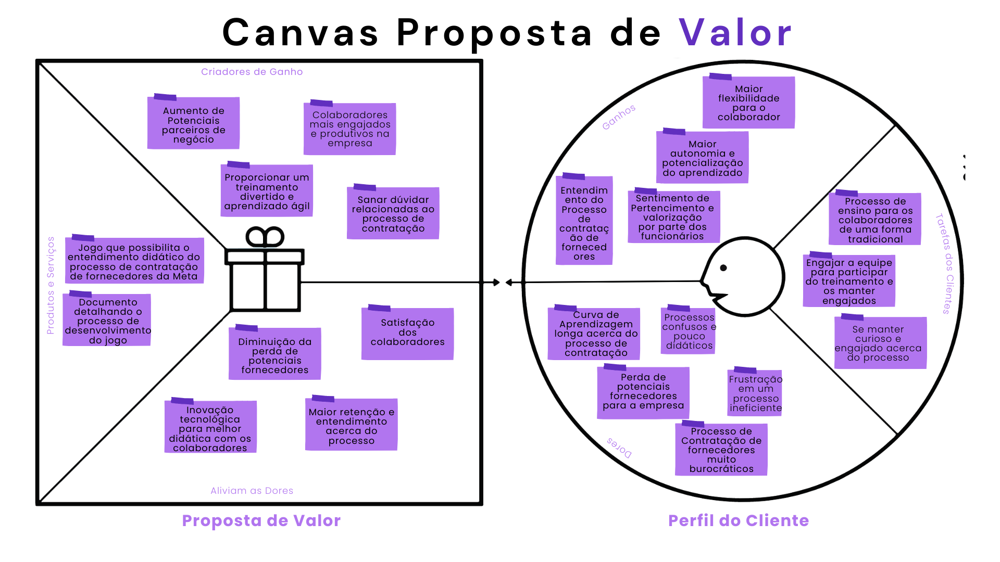
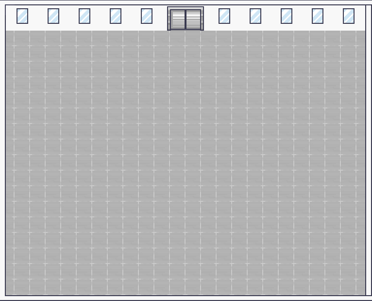

# GDD - Game Design Document - Módulo 1 - Inteli

**_Os trechos em itálico servem apenas como guia para o preenchimento da seção. Por esse motivo, não devem fazer parte da documentação final_**

## Grupo 4

#### Nomes dos integrantes do grupo
- <a>Ana Eloisa da Silva Façanha</a>
- <a>Daniel Augusto de Araújo Gonçalves</a>
- <a>Gabriel Bacci Toledo</a> 
- <a>Giovanna Fátima de Britto Vieira</a> 
- <a>Gustavo Gonçalves da Costa</a>
- <a>Larissa dos Santos Temoteo</a> 

## Sumário

[1. Introdução](#c1)

[2. Visão Geral do Jogo](#c2)

[3. Game Design](#c3)

[4. Desenvolvimento do jogo](#c4)

[5. Casos de Teste](#c5)

[6. Conclusões e trabalhos futuros](#c6)

[7. Referências](#c7)

[Anexos](#c8)

 

# 1. Introdução

## 1.1. Escopo do Projeto

### 1.1.1. Contexto da indústria

A Meta é uma empresa que tem como missão dar às pessoas o poder de criar comunidades e aproximar o mundo, dessa forma, eles desenvolvem produtos voltados para o mercado digital, resolvem problemas e trabalham juntos para conectar pessoas do mundo todo. Além disso, essa empresa possui um caráter social, logo possui ações voltadas para a diversidade, inclusão de todos e preocupação com o bem-estar dos seus funcionários.

Tendo como princípios dar voz às pessoas, criar conexão e comunidade, servir a todos, manter as pessoas seguras, proteger a privacidade e promover oportunidade econômica, a Meta atingiu 3 bilhões de usuários em todo o mundo e se tornou uma das cinco grandes empresas de tecnologia, em conjunto com a Microsoft, Amazon, Apple e Google.

Em 2004 foi lançado o Facebook, após isso, a cartela de produtos da Meta aumentou e incluiu aplicativos como o Messenger, o Instagram e o WhatsApp. Atualmente, a Meta está expandindo os negócios e indo em direção a experiências imersivas com realidade aumentada, virtual e mista. Em decorrência da vasta gama de produtos e serviços a Meta acumulou uma série de concorrentes (tabela abaixo).

Figura 1: Tabela de concorrentes da Meta. Fonte: Autor Próprio (2024)

Entretanto, apesar da vasta quantidade de concorrentes, em fevereiro de 2024 as ações da Meta dispararam e a empresa teve o maior ganho em valor de mercado em um único dia. As ações da Meta subiram 20,3% e esse ganho acrescentou US$ 206 bilhões em valor de mercado, o que fez com que a empresa se destacasse no cenário mundial e se consagrasse como a 34º posição entre as maiores empresas do globo

### 1.1.2. Análise SWOT 

A análise SWOT é uma ferramenta utilizada para identificar as forças, oportunidades, fraquezas e ameaças de uma empresa. Dessa forma, serve como uma forma de identificar oportunidades de melhoria frente à concorrência e à própria equipe, promovendo uma visão de qual o atual cenário da empresa.

No contexto da Análise SWOT, há os fatores internos e externos, quanto aos fatores internos há: as forças são as ações internas que oferecem uma vantagem competitiva para a empresa, são os fatores que indicam o sucesso da empresa. Enquanto as fraquezas são o oposto, são as iniciativas internas que estão abaixo do esperado e indicam o que precisa ser feito para melhorar na empresa.

Quanto aos fatores externos há as oportunidades e ameaças. As oportunidades são as iniciativas externas às empresas mas que promovem uma melhor posição competitiva. Em relação às ameaças são os fatores externos que estão foram do controle da empresa e podem impactar negativamente o cenário competitivo.

Desse modo, considerando as concepções da Análise SWOT foi possível identificar as forças, fraquezas, oportunidades e ameaças que a contempla a Meta, conforme consta abaixo.

Figura 2: Análise SWOT da empresa Meta. Fonte: Autor Próprio (2024)

**Forças:**
- **Equipe qualificada e talentosa:** A empresa possui uma equipe altamente qualificada e talentosa, capaz de impulsionar a inovação e a excelência em seus produtos e serviços.  
- **Marketing e publicidade atraentes:** A empresa investe em estratégias de marketing e publicidade eficazes, que capturam a atenção do público-alvo e promovem o reconhecimento e a preferência de suas marcas e produtos.  
- **Marcas e produtos fortemente presentes:** A empresa possui marcas e produtos bem estabelecidos, com uma presença forte e influente no mercado, o que contribui para sua reputação e sucesso comercial.  
- **Presença de tecnologia de ponta nos serviços ofertados pela empresa:** A empresa oferece serviços que incorporam tecnologia de ponta, proporcionando aos clientes experiências inovadoras e de alta qualidade. 

**Fraquezas:**
- **Falta de otimização nos processos internos:** A empresa enfrenta desafios relacionados à falta de otimização em seus processos internos, o que pode afetar a eficiência operacional e a produtividade.

- **Dificuldade dos colaboradores em entender processos:** Os colaboradores enfrentam dificuldades em entender alguns processos internos da empresa, o que pode impactar negativamente a execução das tarefas e projetos.

- **Constantes comprometimentos na segurança dos dados:** A empresa enfrenta desafios relacionados à segurança dos dados, com ocorrências frequentes de comprometimento, o que pode resultar em perda de confiança dos clientes e danos à reputação da empresa.

- **Renda proveniente do sistema de anúncios:** A empresa depende significativamente da receita gerada pelo sistema de anúncios, o que a torna vulnerável a flutuações no mercado publicitário e mudanças nas políticas de privacidade.

**Oportunidades:**
- **Capacidade de influenciar grandes massas:** A empresa tem a capacidade de influenciar grandes audiências, dada sua presença significativa e impactante no mercado, o que representa uma oportunidade para expandir sua base de clientes e aumentar sua participação de mercado.

- **Capacidade de criar conexões com as mais diversas empresas e instituições:** A empresa possui recursos e alcance para estabelecer conexões com uma variedade de empresas e instituições, o que pode abrir oportunidades para colaborações estratégicas e desenvolvimento de novos produtos e serviços.

- **Possibilidade de explorar novos avanços tecnológicos:** A empresa está em posição de explorar e adotar novos avanços tecnológicos, o que pode impulsionar a inovação e a diferenciação de seus produtos e serviços no mercado.

- **Expandir o mercado:** A empresa tem a oportunidade de expandir seu alcance e penetração em novos mercados geográficos ou segmentos de mercado, o que pode impulsionar o crescimento e a diversificação de suas operações.

**Ameaças:**
- **Mercado com forte concorrência:** A empresa enfrenta uma forte concorrência no mercado, o que pode dificultar a manutenção ou aumento de sua participação de mercado e pressionar os preços e margens de lucro.

- **Economia global instável:** A instabilidade econômica global representa uma ameaça à empresa, pois pode afetar o poder de compra dos consumidores, as condições de crédito e investimento, e a demanda por seus produtos e serviços.

- **Perda de mercado devido a mudanças do consumidor:** Mudanças nas preferências e comportamentos dos consumidores podem levar à perda de participação de mercado da empresa, caso ela não consiga acompanhar ou antecipar essas mudanças de forma eficaz.

- **Riscos de segurança de dados:** A empresa enfrenta riscos significativos relacionados à segurança de dados, incluindo violações de dados, ataques cibernéticos e regulamentações cada vez mais rigorosas de proteção de dados, o que pode resultar em danos à reputação e custos significativos de conformidade e remediação.

Sendo assim, é notável que a análise SWOT da Meta oferece uma visão abrangente das forças, fraquezas, oportunidades e ameaças enfrentadas pela empresa. A Meta, anteriormente conhecida como Facebook, é uma gigante global que moldou a forma como interagimos e nos conectamos digitalmente. Com uma ampla gama de produtos em sua carteira e um marketing marcante, a empresa conquistou uma presença forte e influente em todo o mundo.

### 1.1.3. Descrição da Solução Desenvolvida

A Meta possui um processo para a contratação de fornecedores que perpassa diversas etapas, porém vários colaboradores desconhecem ou possuem dúvidas de partes desse processo. Então, objetivando solucionar esse problema foi idealizado a criação de uma ferramenta gamificada (jogo) com o intuito de capacitar os colaboradores acerca do processo supracitado.

Dessa forma os colaboradores da Meta terão acesso ao jogo para aprender de forma interativa, recebendo feedbacks e recompensas por meio da concusão de diversos desafios ao longo do jogo. 

Sendo assim, é esperado o aumento do engajamento dos usuários devido à abordagem inovadora, promoção de uma assimilação fácil e assertiva do processo, redução dos erros cometidos ao longo do processo e o aumento na eficiência do treinamento, de forma a contribuir para o desenvolvimento dos colaborados e a eficácia do processo de contratação de fornecedores da Meta.

### 1.1.4. Proposta de Valor

O Canvas Proposta de Valor é uma ferramenta que tem como fundamento criar e posicionar produtos ou serviços de acordo com o que o cliente valoriza e precisa. Dessa forma, busca pensar no produto de uma forma mais estrutura e aumentar as chances de fazer o encaixe entre produto e mercado.

Para atingir esse objetivo, a Proposta de Valor conta com dois blocos o Perfil do Cliente e a Proposta de Valor. Nesse primeiro, há a tarefa do cliente, as dores dos clientes e os ganhos dos clientes. Enquanto no segundo bloco estão presentes os produtos e serviços, os aliviadores de dores e os criadores de ganhos. 
Sendo assim, xom o intuito de agregar valor na nossa solução e identificar quais as necessidades dos clientes desenvolvemos um Canvas Proposta de Valor, confome consta na imagem abaixo.

Figura 3. Canvas Proposta de Valor. Fonte: Autor Próprio (2024)

**Dores**
1. **Curva de Aprendizagem longa acerca do processo de contratação:** Os colaboradores podem enfrentar dificuldades para entender e assimilar o processo de contratação de fornecedores devido à sua complexidade e falta de recursos de treinamento adequados.

2. **Processos confusos e pouco didáticos:** A falta de clareza e eficácia nos materiais de treinamento pode levar à confusão e frustração entre os colaboradores.

3. **Frustração em um processo ineficiente:** A ineficiência no processo de contratação pode causar frustração e insatisfação entre os colaboradores, afetando negativamente o desempenho e a moral da equipe.

4. **Perda de potenciais fornecedores para a empresa:** Erros ou falta de compreensão do processo de contratação podem resultar na perda de fornecedores em potencial, prejudicando as relações comerciais e o crescimento da empresa.

5. **Processo de Contratação de fornecedores muito burocráticos:** A burocracia excessiva no processo de contratação pode desencorajar potenciais fornecedores e dificultar a eficiência operacional da empresa.

**Tarefas do Cliente**
1. **Processo de ensino para os colaboradores de uma forma tradicional:** Antes da implementação do jogo, os colaboradores eram treinados de maneira mais convencional, o que pode ser menos eficaz e envolvente.

2. **Engajar a equipe para participar do treinamento e os manter engajados:** Uma das tarefas dos gestores é garantir que os colaboradores participem ativamente do treinamento e permaneçam engajados ao longo do processo.

3. **Se manter curioso e engajado acerca do processo:** Os colaboradores também têm a responsabilidade de se manterem curiosos e interessados no processo de aprendizado, buscando constantemente melhorar suas habilidades e conhecimentos.

**Ganhos**
1. **Maior flexibilidade para o colaborador:** O treinamento gamificado oferece aos colaboradores a flexibilidade de aprender no próprio ritmo e no momento que for mais conveniente para eles.

2. **Maior autonomia e potencialização do aprendizado:** A abordagem do jogo permite que os colaboradores assumam o controle do seu próprio aprendizado, explorando e experimentando o conteúdo de forma independente.

3. **Sentimento de Pertencimento e valorização por parte dos funcionários:** Ao investir no desenvolvimento profissional dos colaboradores de forma inovadora, a empresa demonstra seu compromisso com o crescimento e o bem-estar da equipe, promovendo um ambiente de trabalho positivo e inclusivo.

4. **Entendimento do Processo de contratação de fornecedores:** O treinamento eficaz proporcionado pelo jogo ajuda os colaboradores a compreender e dominar o processo de contratação de fornecedores, permitindo que eles desempenhem suas funções com mais confiança e eficiência. 

**Criadores de Ganho**
1. **Aumento de Potenciais parceiros de negócio:** Implementar o jogo de treinamento pode atrair mais fornecedores interessados em trabalhar com a Meta, devido à reputação da empresa como inovadora e comprometida com o desenvolvimento de seus colaboradores.

2. **Colaboradores mais engajados e produtivos na empresa:** Um treinamento divertido e interativo pode aumentar o engajamento dos colaboradores, o que geralmente leva a um aumento da produtividade e satisfação no trabalho.

3. **Proporcionar um treinamento divertido e aprendizado ágil:** Ao transformar o processo de aprendizado em um jogo, os colaboradores podem absorver o conhecimento de forma mais rápida e eficaz, tornando o treinamento mais eficiente e agradável.

4. **Sanar dúvidas relacionadas ao processo de contratação:** O jogo oferece uma oportunidade para os colaboradores esclarecerem suas dúvidas de forma prática e interativa, facilitando a compreensão do processo de contratação.

**Aliviam as Dores**
1. **Diminuição da perda de potenciais fornecedores:** Ao fornecer um treinamento mais eficaz e envolvente, a empresa pode reduzir a perda de fornecedores devido a erros ou falta de compreensão do processo.

2. **Satisfação dos colaboradores:** Um treinamento mais atraente e eficaz pode aumentar a satisfação dos colaboradores, ajudando a reter talentos e reduzir a rotatividade.

3. **Maior retenção e entendimento acerca do processo:** A abordagem do jogo pode ajudar os colaboradores a reter e entender melhor o processo de contratação, reduzindo a confusão e os erros.

4. **Inovação tecnológica para melhor didática com os colaboradores:** Utilizar uma abordagem tecnológica e inovadora no treinamento pode tornar o processo mais acessível e eficaz para os colaboradores.

**Produtos e Serviços**
1. **Documento detalhando o processo de desenvolvimento do jogo:** Este documento fornecerá uma visão abrangente do processo de criação do jogo, incluindo todos os aspectos técnicos e de design.

2. **Jogo que possibilita o entendimento didático do processo de contratação de fornecedores da Meta:** O jogo é o produto final, projetado para oferecer aos colaboradores uma experiência de aprendizado imersiva e eficaz sobre o processo de contratação.

### 1.1.5. Matriz de Riscos

A Matriz de Risco é outra ferramenta que utilizada para a avaliar a probabilidade de determinados eventos ocorrerem e quais os impactos desse evento. Para isso, é proposto a construção de uma tabela que possui o eixo vertical como probabilidade e o eixo horizontal como impacto. 

Sendo assim, a probabilidade indica o quão previsível é que um risco ocorra e qual a frequência que ele pode acontecer, enquanto o impacto indica as consequências quando o risco de fato acontece. 

Dessa forma, a Matriz de risco serve para avaliar o potencial de risco na produção desse projeto e ajudar no planejamento de ações para evitar que esses ocorram.

Figura 4. Matriz de Riscos. Fonte: Autor Próprio (2024)

De acordo com os riscos estabelecidos foi possível determinar quais ações seriam tomadas para evitar que estes ocorressem e o que seria feito caso ocorressem.

\# Risco | Plano de Ação e Resposta 
--- | ---
**Impasses gerados por ideias divergentes** | Entrar em consenso por meio do diálogo e reuniões
**Ausência de conhecimento técnico** | Buscar nivelar o mais proximo possivel os assuntos a serem abordados
**Divisão de tarefas ineficiente** | Construir um bom plano de ações e organizar os objetivos de maineira clara e simples sozinho ou em dupla
**Atraso nas entregas** | Buscar comprometimento e se atentar aos prazos
**Comunicação malsucedida** | Praticar escuta ativa e melhorar os meios de comunicação
**Falta de experiência com atividades que envolvam programação** | Buscar os conteudos de forma mais suscinta para  areas e coisas de interesse semelhante ao gosto do aluno
**Dificuldade com  gerenciamento socioemocional** | Aprender a lidar bem com suas emoções e da próximo, tendo sempre como princípio respeitar as individualidades
**Má gestão de tempo** | Fazer uso de um bom planejamento, adiantar trabalhos e objetivos para não dar janela para imprevistos
**Ausência por motivo de saúde** | Buscar manter uma alimentação e cuidados saudáveis como individuo para eviatar adoecimento biologico ou mental
**Dificuldade em assimilar o exercício proposto** | Tirar duvidas por meio de perguntas ou de outros exercícios semelhantes com ajuda de professor ou colegas

## 1.2. Requisitos do Projeto

Durante a reunião com o parceiro do projeto foi possível definir uma série de requisitos que contemplam desde a estética até a mecânica do jogo.

**Tabela de requisitos**
\# | **Requisito**  
--- | ---
1 | Garantir que os usuários estejam curiosos e ativos em relação aos processos de forma a reduzir os riscos na contratação.
2 | Garantir que o colaborador saiba o processo.
3 | Desconstruir a ideia que é um processo complicado e garantir um senso de responsabilidade. 
4 | Jogo de curta duração (15 minutos aproximadamente).
5 | Interface prática de ser acessada com o máximo de inovação.
6 | Utilizar cases de exemplo.
7 | O jogo pode ter uma opção em inglês, mas o português deve ser priorizados;
8 | Ofertar tanto Mobile quanto para Computador.
9 | Possibilitar o compartilhamento da conclusão de fases do jogo.

## 1.3. Público-alvo do Projeto (sprint 2)

*Posicione aqui uma descrição justificada do público-alvo do jogo, em termos demográficos e de preferências/gostos pessoais.*

# 2. Visão Geral do Jogo (sprint 2)

## 2.1. Objetivos do Jogo (sprint 2)

*Descreva o que o jogador deve cumprir para avançar ou concluir o jogo*

## 2.2. Características do Jogo (sprint 2)

### 2.2.1. Gênero do Jogo (sprint 2)

*simulação, RPG, corrida, estratégia, esportes, ação, aventura etc.*  

### 2.2.2. Plataforma do Jogo (sprint 2)

*quanto ao dispositivo: desktop, smartphones, tablets, TV etc.*

*quanto ao sistema: Web, Windows, MacOS, Android, IOS etc.*

### 2.2.3. Número de jogadores (sprint 2)

*1 jogador, 2 jogadores versus, 2 jogadores cooperação, multiplayer etc.*

### 2.2.4. Títulos semelhantes e inspirações (sprint 2)

*Liste e descreva títulos semelhantes e jogos que inspiram e são usados como referência do projeto*

### 2.2.5. Tempo estimado de jogo (sprint 5)

*Ex. O jogo pode ser concluído em 3 horas passando por todas as fases.*

*Ex. cada partida dura até 15 minutos*

# 3. Game Design (sprints 2 e 3)

## 3.1. Enredo do Jogo (sprints 2 e 3)

*Descreva o enredo/história do jogo, criando contexto para os personagens (seção 3.2) e o mundo do jogo (seção 3.3). Uma boa história costuma ter um arco narrativo de contexto, conflito e resolução. Utilize etapas sequenciais para descrever esta história.* 

*Caso seu jogo não possua enredo/história (ex. jogo Tetris), mencione os motivos de não existir e como o jogador pode se contextualizar com o ambiente do jogo.*

## 3.2. Personagens (sprints 2 e 3)

### 3.2.1. Controláveis

*Descreva os personagens controláveis pelo jogador. Mencione nome, objetivos, características, habilidades, diferenciais etc. Utilize figuras (character art, sprite sheets etc.) para ilustrá-los. Caso utilize material de terceiros em licença Creative Commons, não deixe de citar os autores/fontes.* 

*Caso não existam personagens (ex. jogo Tetris), mencione os motivos de não existirem e como o jogador pode interpretar tal fato.*

### 3.2.2. Non-Playable Characters (NPC)

*\<opcional\> Se existirem coadjuvantes ou vilões, aqui é o local para descrevê-los e ilustrá-los. Utilize listas ou tabelas para organizar esta seção. Caso utilize material de terceiros em licença Creative Commons, não deixe de citar os autores/fontes. Caso não existam NPCs, remova esta seção.*

### 3.2.3. Diversidade e Representatividade dos Personagens

Considerando as personagens do game, analise se estas estão alinhadas ao público-alvo do jogo (seção 1.3), e compare-as dentro da realidade da sociedade brasileira. Por fim, discorra sobre qual é o impacto esperado da escolha dessas personagens.

## 3.3. Mundo do jogo (sprints 2 e 3)

### 3.3.1. Locações Principais e/ou Mapas (sprints 2 e 3)

*Descreva o ambiente do jogo, em que locais ele ocorre. Ilustre com imagens. Se houverem mapas, posicione-os aqui, descrevendo as áreas em acordo com o enredo. Se houverem fases, descreva-as também em acordo com o enredo (pode ser um jogo de uma fase só). Utilize listas ou tabelas para organizar esta seção. Caso utilize material de terceiros em licença Creative Commons, não deixe de citar os autores/fontes.*

### 3.3.2. Navegação pelo mundo (sprints 2 e 3)

*Descreva como os personagens se movem no mundo criado e as relações entre as locações – como as áreas/fases são acessadas ou desbloqueadas, o que é necessário para serem acessadas etc. Utilize listas ou tabelas para organizar esta seção.*

### 3.3.3. Condições climáticas e temporais (sprints 2 e 3)

*\<opcional\> Descreva diferentes condições de clima que podem afetar o mundo e as fases, se aplicável*

*Caso seja relevante, descreva como o tempo passa, se ele é um fator limitante ao jogo (ex. contagem de tempo para terminar uma fase)*

### 3.3.4. Concept Art (sprint 2)

*Inclua imagens de Concept Art do jogo que ainda não foram demonstradas em outras seções deste documento. Para cada imagem, coloque legendas, como no exemplo abaixo.*

Figura 1: detalhe da cena da partida do herói para a missão, usando sua nave

### 3.3.5. Trilha sonora (sprint 3)

*Descreva a trilha sonora do jogo, indicando quais músicas serão utilizadas no mundo e nas fases. Utilize listas ou tabelas para organizar esta seção. Caso utilize material de terceiros em licença Creative Commons, não deixe de citar os autores/fontes.*

*Exemplo de tabela*
\# | titulo | ocorrência | autoria
--- | --- | --- | ---
1 | tema de abertura | tela de início | própria
2 | tema de combate | cena de combate com inimigos comuns | Hans Zimmer
3 | ... 

## 3.4. Inventário e Bestiário (sprint 3)

### 3.4.1. Inventário

*\<opcional\> Caso seu jogo utilize itens ou poderes para os personagens obterem, descreva-os aqui, indicando títulos, imagens, meios de obtenção e funções no jogo. Utilize listas ou tabelas para organizar esta seção. Caso utilize material de terceiros em licença Creative Commons, não deixe de citar os autores/fontes.* 

*Exemplo de tabela*
\# | item |  | como obter | função | efeito sonoro
--- | --- | --- | --- | --- | ---
1 | moeda |  | há muitas espalhadas em todas as fases | acumula dinheiro para comprar outros itens | som de moeda
2 | madeira |  | há muitas espalhadas em todas as fases | acumula madeira para construir casas | som de madeiras
3 | ... 

### 3.4.2. Bestiário

*\<opcional\> Caso seu jogo tenha inimigos, descreva-os aqui, indicando nomes, imagens, momentos de aparição, funções e impactos no jogo. Utilize listas ou tabelas para organizar esta seção. Caso utilize material de terceiros em licença Creative Commons, não deixe de citar os autores/fontes.* 

*Exemplo de tabela*
\# | inimigo |  | ocorrências | função | impacto | efeito sonoro
--- | --- | --- | --- | --- | --- | ---
1 | robô terrestre |  |  a partir da fase 1 | ataca o personagem vindo pelo chão em sua direção, com velocidade constante, atirando parafusos | se encostar no inimigo ou no parafuso arremessado, o personagem perde 1 ponto de vida | sons de tiros e engrenagens girando
2 | robô voador |  | a partir da fase 2 | ataca o personagem vindo pelo ar, fazendo movimento em 'V' quando se aproxima | se encostar, o personagem perde 3 pontos de vida | som de hélice
3 | ... 

## 3.5. Gameflow (Diagrama de cenas) (sprint 2)

*Posicione aqui seu "storyboard de programação" - o diagrama de cenas do jogo. Indique, por exemplo, como o jogo começa, quais opções o jogador tem, como ele avança nas fases, quais as condições de 'game over', como o jogo reinicia. Seu diagrama deve representar as classes, atributos e métodos usados no jogo.*

## 3.6. Regras do jogo (sprint 3)

*Descreva aqui as regras do seu jogo: objetivos/desafios, meios para se conseguir alcançar*

*Ex. O jogador deve pilotar o carro e conseguir terminar a corrida dentro de um minuto sem bater em nenhum obstáculo.*

*Ex. O jogador deve concluir a fase dentro do tempo, para obter uma estrela. Se além disso ele coletar todas as moedas, ganha mais uma estrela. E se além disso ele coletar os três medalhões espalhados, ganha mais uma estrela, totalizando três. Ao final do jogo, obtendo três estrelas em todas as fases, desbloqueia o mundo secreto.*  

## 3.7. Mecânicas do jogo (sprint 3)

*Descreva aqui as formas de controle e interação que o jogador tem sobre o jogo: quais os comandos disponíveis, quais combinações de comandos, e quais as ações consequentes desses comandos. Utilize listas ou tabelas para organizar esta seção.*

*Ex. Em um jogo de plataforma 2D para desktop, o jogador pode usar as teclas WASD para mecânicas de andar, mirar para cima, agachar, e as teclas JKL para atacar, correr, arremesar etc.*

*Ex. Em um jogo de puzzle para celular, o jogador pode tocar e arrastar sobre uma peça para movê-la sobre o tabuleiro, ou fazer um toque simples para rotacioná-la*

# 4. Desenvolvimento do Jogo

## 4.1. Desenvolvimento preliminar do jogo (sprint 1)

Para o desenvolvimento preliminar no jogo foram realizados testes de cenários, escolhas de design e algumas diretrizes para o jogo. Nesses testes de cenário foram produzidos dois andares de um possível prédio da Meta, na primeira imagem(figura 5) consta uma sala da recepção para visitantes e na segunda (figura 6) consta o ambiente de trabalho dos colaboradores da empresa.

Figura 5. Ambiente de Recepção. Fonte: Autor Próprio(2024).

Figura 6. Escritório dos Colaboradores da Meta. Fonte: Autor Próprio(2024).

Quanto ao jogo preliminar foi utilizado um cenário mais limpo, que contém apenas o piso e as paredes do escritório, conforme consta na imagem abaixo.

Figura 7. Cenário Preliminar do Game. Fonte: Autor Próprio(2024).

## 4.2. Desenvolvimento básico do jogo (sprint 2)

*Descreva e ilustre aqui o desenvolvimento da versão básica do jogo, explicando brevemente o que foi entregue em termos de código e jogo. Utilize prints de tela para ilustrar. Indique as eventuais dificuldades e próximos passos.*

## 4.3. Desenvolvimento intermediário do jogo (sprint 3)

*Descreva e ilustre aqui o desenvolvimento da versão intermediária do jogo, explicando brevemente o que foi entregue em termos de código e jogo. Utilize prints de tela para ilustrar. Indique as eventuais dificuldades e próximos passos.*

## 4.4. Desenvolvimento final do MVP (sprint 4)

*Descreva e ilustre aqui o desenvolvimento da versão final do jogo, explicando brevemente o que foi entregue em termos de MVP. Utilize prints de tela para ilustrar. Indique as eventuais dificuldades e planos futuros.*

## 4.5. Revisão do MVP (sprint 5)

*Descreva e ilustre aqui o desenvolvimento dos refinamentos e revisões da versão final do jogo, explicando brevemente o que foi entregue em termos de MVP. Utilize prints de tela para ilustrar.*

# 5. Testes (sprint 4)

## 5.1. Casos de Teste

*Descreva nesta seção os casos de teste comuns que podem ser executados a qualquer momento para testar o funcionamento e integração das partes do jogo. Utilize tabelas para facilitar a organização.*

*Exemplo de tabela*
\# | pré-condição | descrição do teste | pós-condição 
--- | --- | --- | --- 
1 | posicionar o jogo na tela de abertura | iniciar o jogo desde seu início | o jogo deve iniciar da fase 1
2 | posicionar o personagem em local seguro de inimigos | aguardar o tempo passar até o final da contagem | o personagem deve perder uma vida e reiniciar a fase
3 | ...

## 5.2. Testes de jogabilidade (playtests) (sprint 4)

### 5.2.1 Registros de testes

*Descreva nesta seção as sessões de teste/entrevista com diferentes jogadores. Registre cada teste conforme o template a seguir.*

Nome | João Jonas (use nomes fictícios)
--- | ---
Já possuía experiência prévia com games? | sim, é um jogador casual
Conseguiu iniciar o jogo? | sim
Entendeu as regras e mecânicas do jogo? | entendeu as regras, mas sobre as mecânicas, apenas as essenciais, não explorou os comandos complexos
Conseguiu progredir no jogo? | sim, sem dificuldades  
Apresentou dificuldades? | Não, conseguiu jogar com facilidade e afirmou ser fácil
Que nota deu ao jogo? | 9.0
O que gostou no jogo? | Gostou  de como o jogo vai ficando mais difícil ao longo do tempo sem deixar de ser divertido
O que poderia melhorar no jogo? | A responsividade do personagem aos controles, disse que havia um pouco de atraso desde o momento do comando até a resposta do personagem

### 5.2.2 Melhorias

*Descreva nesta seção um plano de melhorias sobre o jogo, com base nos resultados dos testes de jogabilidade*

# 6. Conclusões e trabalhos futuros (sprint 5)

*Escreva de que formas a solução do jogo atingiu os objetivos descritos na seção 1 deste documento. Indique pontos fortes e pontos a melhorar de maneira geral.*

*Relacione os pontos de melhorias evidenciados nos testes com plano de ações para serem implementadas no jogo. O grupo não precisa implementá-las, pode deixar registrado aqui o plano para futuros desenvolvimentos.*

*Relacione também quaisquer ideias que o grupo tenha para melhorias futuras*

# 7. Referências (sprint 5)

_Incluir as principais referências de seu projeto, para que seu parceiro possa consultar caso ele se interessar em aprofundar. Um exemplo de referência de livro e de site:_ 

LUCK, Heloisa. Liderança em gestão escolar. 4. ed. Petrópolis: Vozes, 2010.  
SOBRENOME, Nome. Título do livro: subtítulo do livro. Edição. Cidade de publicação: Nome da editora, Ano de publicação.  

